# cvs-arr-01: 26F, heart racing, switched on like a light

_Generated by `npm run graph`; do not edit by hand._

Shapes: rounded = story, box = decision, double box = ending (red border = critical).
Arrow marks: ✓ best · ~ acceptable · ↓ suboptimal · ✗ harmful (red dashed). **Bold arrows = ideal path.**

```mermaid
flowchart TD
  n_arrival(["<b>arrival</b><br/><i>story</i><br/>Triage"])
  n_first_move["<b>first-move</b><br/><i>choice</i><br/>Your first move?"]:::decision
  n_ecg_1["<b>ecg-1</b><br/><i>ecg</i><br/>What does the ECG show?"]:::decision
  n_vagal["<b>vagal</b><br/><i>choice</i><br/>She's stable. First treatment?"]:::decision
  n_adenosine["<b>adenosine</b><br/><i>choice</i><br/>Adenosine. How do you give the fi…"]:::decision
  n_second_dose["<b>second-dose</b><br/><i>choice</i><br/>The first dose didn't convert her…"]:::decision
  n_converted(["<b>converted</b><br/><i>story</i><br/>Majors"])
  n_post_ecg["<b>post-ecg</b><br/><i>ecg</i><br/>Her ECG after conversion. What ar…"]:::decision
  n_disposition["<b>disposition</b><br/><i>choice</i><br/>She feels well an hour later. Pla…"]:::decision
  n_end_good[["<b>end-good</b><br/><i>ending</i><br/>GOOD"]]:::good
  n_end_fair[["<b>end-fair</b><br/><i>ending</i><br/>FAIR"]]:::fair
  n_arrival --> n_first_move
  n_first_move -->|"✓ Monitor, large cannula in t… / ↓ Synchronised cardioversion … / ✗ Probably anxiety: reassure …"| n_ecg_1
  n_ecg_1 -->|"✓ Regular narrow-complex tach… / ↓ Sinus tachycardia / ↓ Atrial fibrillation with a …"| n_vagal
  n_vagal -->|"✓ Modified Valsalva: strain i… / ~ Standard Valsalva, sitting … / ✗ Firm pressure on both eyeba… …"| n_adenosine
  n_adenosine -->|"✓ 6 mg as a rapid push throug… / ↓ 6 mg slowly through the can… / ↓ 12 mg straight away to save…"| n_second_dose
  n_second_dose -->|"✓ 12 mg rapid push with flush… / ↓ 18 mg now / ↓ Synchronised cardioversion …"| n_converted
  n_converted --> n_post_ecg
  n_post_ecg -->|"✓ Pre-excitation: short PR an… / ↓ Nothing more to look for no…"| n_disposition
  n_disposition -->|"✓ Discharge with copies of bo… · if patient meter #lt; 70 / ~ Start a daily beta-blocker … · if patient meter #lt; 70 / ↓ Admit for serial troponins … · if patient meter #lt; 70"| n_end_fair
  n_disposition -->|"✓ Discharge with copies of bo… · otherwise / ~ Start a daily beta-blocker … · otherwise / ↓ Admit for serial troponins … · otherwise"| n_end_good
  linkStyle 0 stroke-width:4px
  linkStyle 1 stroke-width:4px
  linkStyle 2 stroke-width:4px
  linkStyle 3 stroke-width:4px
  linkStyle 4 stroke-width:4px
  linkStyle 5 stroke-width:4px
  linkStyle 6 stroke-width:4px
  linkStyle 7 stroke-width:4px
  linkStyle 9 stroke-width:4px
  classDef decision stroke-width:2px
  classDef good stroke:#1a1915,stroke-width:3px
  classDef fair stroke:#8a877d,stroke-width:3px
  classDef critical stroke:#c62828,stroke-width:3px
```

## Ideal path

- **all settings:** arrival → first-move → ecg-1 → vagal → adenosine → second-dose → converted → post-ecg → disposition → end-good
