# cvs-arr-03: 68M, palpitations since breakfast

_Generated by `npm run graph`; do not edit by hand._

Shapes: rounded = story, box = decision, double box = ending (red border = critical).
Arrow marks: ✓ best · ~ acceptable · ↓ suboptimal · ✗ harmful (red dashed). **Bold arrows = ideal path.**

```mermaid
flowchart TD
  n_arrival(["<b>arrival</b><br/><i>story</i><br/>Triage"])
  n_first_move["<b>first-move</b><br/><i>choice</i><br/>Your first move?"]:::decision
  n_ecg_1["<b>ecg-1</b><br/><i>ecg</i><br/>What does the ECG show?"]:::decision
  n_driver(["<b>driver</b><br/><i>story</i><br/>Majors"])
  n_strategy["<b>strategy</b><br/><i>choice</i><br/>Stable, no driver found, onset cl…"]:::decision
  n_rate["<b>rate</b><br/><i>choice</i><br/>Rate control while you arrange th…"]:::decision
  n_anticoag["<b>anticoag</b><br/><i>choice</i><br/>Anticoagulation before the cardio…"]:::decision
  n_shock["<b>shock</b><br/><i>choice</i><br/>He's sedated for electrical cardi…"]:::decision
  n_cha2ds2["<b>cha2ds2</b><br/><i>calculator</i><br/>He's in sinus rhythm. Work out hi…"]:::decision
  n_long_term["<b>long-term</b><br/><i>choice</i><br/>He's back in sinus rhythm with CH…"]:::decision
  n_end_good[["<b>end-good</b><br/><i>ending</i><br/>GOOD"]]:::good
  n_end_fair[["<b>end-fair</b><br/><i>ending</i><br/>FAIR"]]:::fair
  n_arrival --> n_first_move
  n_first_move -->|"✓ 12-lead ECG and monitor; bl… / ✗ IV amiodarone to slow the r…"| n_ecg_1
  n_ecg_1 -->|"✓ Atrial fibrillation with a … / ↓ Atrial flutter / ↓ NSTEMI: lateral ST depressi…"| n_driver
  n_driver --> n_strategy
  n_strategy -->|"✓ Control the rate, start ant… / ~ Control the rate, anticoagu… / ✗ Cardiovert now and discharg…"| n_rate
  n_rate -->|"✓ IV metoprolol 2.5–5 mg slow… / ~ IV diltiazem / ↓ IV digoxin alone"| n_anticoag
  n_anticoag -->|"✓ Start a DOAC (or heparin) n… / ↓ No need: he's been in AF le…"| n_shock
  n_shock -->|"✓ Synchronised, maximum outpu… / ↓ Synchronised, 50 J"| n_cha2ds2
  n_cha2ds2 --> n_long_term
  n_long_term -->|"✓ Continue the DOAC long term… · if patient meter #lt; 70 / ✗ Stop it after 4 weeks since… · if patient meter #lt; 70 / ↓ Aspirin instead · if patient meter #lt; 70"| n_end_fair
  n_long_term -->|"✓ Continue the DOAC long term… · otherwise / ✗ Stop it after 4 weeks since… · otherwise / ↓ Aspirin instead · otherwise"| n_end_good
  linkStyle 0 stroke-width:4px
  linkStyle 1 stroke-width:4px
  linkStyle 2 stroke-width:4px
  linkStyle 3 stroke-width:4px
  linkStyle 4 stroke-width:4px
  linkStyle 5 stroke-width:4px
  linkStyle 6 stroke-width:4px
  linkStyle 7 stroke-width:4px
  linkStyle 8 stroke-width:4px
  linkStyle 9 stroke:#c62828,stroke-dasharray:4 3
  linkStyle 10 stroke-width:4px
  classDef decision stroke-width:2px
  classDef good stroke:#1a1915,stroke-width:3px
  classDef fair stroke:#8a877d,stroke-width:3px
  classDef critical stroke:#c62828,stroke-width:3px
```

## Ideal path

- **all settings:** arrival → first-move → ecg-1 → driver → strategy → rate → anticoag → shock → cha2ds2 → long-term → end-good
