# cvs-arr-05: 59M, a steady 150 that won't settle

_Generated by `npm run graph`; do not edit by hand._

Shapes: rounded = story, box = decision, double box = ending (red border = critical).
Arrow marks: ✓ best · ~ acceptable · ↓ suboptimal · ✗ harmful (red dashed). **Bold arrows = ideal path.**

```mermaid
flowchart TD
  n_arrival(["<b>arrival</b><br/><i>story</i><br/>Triage"])
  n_first_move["<b>first-move</b><br/><i>choice</i><br/>Your first move?"]:::decision
  n_ecg_1["<b>ecg-1</b><br/><i>ecg</i><br/>What does the ECG show?"]:::decision
  n_adenosine["<b>adenosine</b><br/><i>choice</i><br/>A colleague still thinks it's SVT…"]:::decision
  n_unmasked(["<b>unmasked</b><br/><i>story</i><br/>During adenosine"])
  n_plan["<b>plan</b><br/><i>choice</i><br/>Flutter for two days, stable. Pla…"]:::decision
  n_rate["<b>rate</b><br/><i>choice</i><br/>Rate control. No heart failure, B…"]:::decision
  n_cha2ds2["<b>cha2ds2</b><br/><i>calculator</i><br/>Work out his CHA₂DS₂-VA score."]:::decision
  n_shock["<b>shock</b><br/><i>dose</i><br/>Synchronised cardioversion for at…"]:::decision
  n_long_term["<b>long-term</b><br/><i>choice</i><br/>He's in sinus rhythm. Long-term p…"]:::decision
  n_end_good[["<b>end-good</b><br/><i>ending</i><br/>GOOD"]]:::good
  n_end_fair[["<b>end-fair</b><br/><i>ending</i><br/>FAIR"]]:::fair
  n_arrival --> n_first_move
  n_first_move -->|"✓ 12-lead ECG and monitor / ↓ Adenosine 6 mg for the SVT,…"| n_ecg_1
  n_ecg_1 -->|"✓ Atrial flutter with 2:1 blo… / ↓ AVNRT / ↓ Sinus tachycardia"| n_adenosine
  n_adenosine -->|"✓ Give it as a diagnostic tes… / ↓ Repeat adenosine until it c…"| n_unmasked
  n_adenosine -->|"~ Not needed: the ECG already…"| n_plan
  n_unmasked --> n_plan
  n_plan -->|"✓ Rate control and anticoagul… / ✗ Cardiovert today without an… / ✗ Oral flecainide to convert …"| n_rate
  n_rate -->|"✓ IV metoprolol 2.5–5 mg slow… / ~ IV diltiazem"| n_cha2ds2
  n_cha2ds2 --> n_shock
  n_shock --> n_long_term
  n_long_term -->|"✓ Refer for cavotricuspid ist… · if patient meter #lt; 70 / ✗ Stop the anticoagulant toda… · if patient meter #lt; 70"| n_end_fair
  n_long_term -->|"✓ Refer for cavotricuspid ist… · otherwise / ✗ Stop the anticoagulant toda… · otherwise"| n_end_good
  linkStyle 0 stroke-width:4px
  linkStyle 1 stroke-width:4px
  linkStyle 2 stroke-width:4px
  linkStyle 3 stroke-width:4px
  linkStyle 5 stroke-width:4px
  linkStyle 6 stroke-width:4px
  linkStyle 7 stroke-width:4px
  linkStyle 8 stroke-width:4px
  linkStyle 9 stroke-width:4px
  linkStyle 10 stroke:#c62828,stroke-dasharray:4 3
  linkStyle 11 stroke-width:4px
  classDef decision stroke-width:2px
  classDef good stroke:#1a1915,stroke-width:3px
  classDef fair stroke:#8a877d,stroke-width:3px
  classDef critical stroke:#c62828,stroke-width:3px
```

## Ideal path

- **all settings:** arrival → first-move → ecg-1 → adenosine → unmasked → plan → rate → cha2ds2 → shock → long-term → end-good
