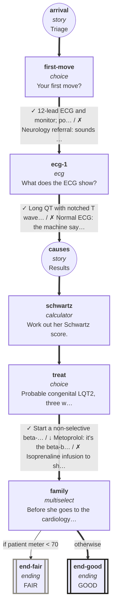

# cvs-arr-12: 27F, three weeks after delivery, fainted when the alarm rang

_Generated by `npm run graph`; do not edit by hand._

Shapes: rounded = story, box = decision, double box = ending (red border = critical).
Arrow marks: ✓ best · ~ acceptable · ↓ suboptimal · ✗ harmful (red dashed). **Bold arrows = ideal path.**

## Ideal path

- **all settings:** arrival → first-move → ecg-1 → causes → schwartz → treat → family → end-good
