# cvs-arr-13: 55M collapses in the waiting area

_Generated by `npm run graph`; do not edit by hand._

Shapes: rounded = story, box = decision, double box = ending (red border = critical).
Arrow marks: ✓ best · ~ acceptable · ↓ suboptimal · ✗ harmful (red dashed). **Bold arrows = ideal path.**

```mermaid
flowchart TD
  n_arrival(["<b>arrival</b><br/><i>story</i><br/>Waiting area"])
  n_first_move["<b>first-move</b><br/><i>choice</i><br/>Unresponsive, not breathing norma…"]:::decision
  n_pads["<b>pads</b><br/><i>choice</i><br/>Pads on. Rhythm?"]:::decision
  n_shock_1["<b>shock-1</b><br/><i>dose</i><br/>Unsynchronised shock for VF. Ener…"]:::decision
  n_after_shock["<b>after-shock</b><br/><i>choice</i><br/>The shock has just been delivered…"]:::decision
  n_third_shock["<b>third-shock</b><br/><i>choice</i><br/>Still VF after the third shock. D…"]:::decision
  n_fifth_shock["<b>fifth-shock</b><br/><i>multiselect</i><br/>Refractory VF. Choose up to 3."]:::decision
  n_rosc(["<b>rosc</b><br/><i>story</i><br/>After the sixth shock"])
  n_rosc_ecg["<b>rosc-ecg</b><br/><i>ecg</i><br/>His ECG after return of circulati…"]:::decision
  n_post_rosc["<b>post-rosc</b><br/><i>multiselect</i><br/>Before he goes to the cath lab. C…"]:::decision
  n_end_good[["<b>end-good</b><br/><i>ending</i><br/>GOOD"]]:::good
  n_end_fair[["<b>end-fair</b><br/><i>ending</i><br/>FAIR"]]:::fair
  n_arrival --> n_first_move
  n_first_move -->|"✓ Call the arrest team, start… / ✗ Feel carefully for a caroti… / ✗ Lift him onto a trolley and…"| n_pads
  n_pads -->|"✓ VF: shockable / ✗ Asystole: give adrenaline"| n_shock_1
  n_shock_1 --> n_after_shock
  n_after_shock -->|"✓ Restart compressions immedi… / ↓ Check for a pulse and look … / ↓ Give two more shocks straig…"| n_third_shock
  n_third_shock -->|"✓ Adrenaline 1 mg IV and amio… / ↓ Adrenaline only; amiodarone… / ✗ Atropine 3 mg and calcium"| n_fifth_shock
  n_fifth_shock --> n_rosc
  n_rosc --> n_rosc_ecg
  n_rosc_ecg -->|"✓ Anterior STEMI: call the ca… / ✗ Post-arrest changes: repeat…"| n_post_rosc
  n_post_rosc -->|"if patient meter #lt; 70"| n_end_fair
  n_post_rosc -->|"otherwise"| n_end_good
  linkStyle 0 stroke-width:4px
  linkStyle 1 stroke-width:4px
  linkStyle 2 stroke-width:4px
  linkStyle 3 stroke-width:4px
  linkStyle 4 stroke-width:4px
  linkStyle 5 stroke-width:4px
  linkStyle 6 stroke-width:4px
  linkStyle 7 stroke-width:4px
  linkStyle 8 stroke-width:4px
  linkStyle 10 stroke-width:4px
  classDef decision stroke-width:2px
  classDef good stroke:#1a1915,stroke-width:3px
  classDef fair stroke:#8a877d,stroke-width:3px
  classDef critical stroke:#c62828,stroke-width:3px
```

## Ideal path

- **all settings:** arrival → first-move → pads → shock-1 → after-shock → third-shock → fifth-shock → rosc → rosc-ecg → post-rosc → end-good
