# cvs-cp-01: 58M, heavy chest, cold sweat

_Generated by `npm run graph`; do not edit by hand._

Shapes: rounded = story, box = decision, double box = ending (red border = critical).
Arrow marks: ✓ best · ~ acceptable · ↓ suboptimal · ✗ harmful (red dashed). **Bold arrows = ideal path.**

```mermaid
flowchart TD
  n_arrival(["<b>arrival</b><br/><i>story</i><br/>Triage"])
  n_first_move["<b>first-move</b><br/><i>choice</i><br/>Your first move?"]:::decision
  n_nitrate_crash(["<b>nitrate-crash</b><br/><i>story</i><br/>Resus bay"])
  n_nitrate_rescue["<b>nitrate-rescue</b><br/><i>choice</i><br/>His BP has fallen sharply after t…"]:::decision
  n_ste_leads["<b>ste-leads</b><br/><i>tap leads</i><br/>Tap every lead that shows ST elev…"]:::decision
  n_reciprocal_leads["<b>reciprocal-leads</b><br/><i>tap leads</i><br/>Now tap the leads with reciprocal…"]:::decision
  n_ecg_1["<b>ecg-1</b><br/><i>ecg</i><br/>Put it together. What does this E…"]:::decision
  n_senior_review(["<b>senior-review</b><br/><i>story</i><br/>Resus bay"])
  n_culprit["<b>culprit</b><br/><i>choice</i><br/>Which artery is most likely block…"]:::decision
  n_right_leads["<b>right-leads</b><br/><i>choice</i><br/>Inferior STEMI with a low BP and …"]:::decision
  n_v4r["<b>v4r</b><br/><i>ecg</i><br/>Right-sided leads. What do they s…"]:::decision
  n_treatment["<b>treatment</b><br/><i>multiselect</i><br/>Initial treatment while reperfusi…"]:::decision
  n_dose_ufh["<b>dose-ufh</b><br/><i>dose</i><br/>Unfractionated heparin IV bolus f…"]:::decision
  n_reperfusion_pci["<b>reperfusion-pci</b><br/><i>choice</i><br/>You're in a PCI-capable centre. R…"]:::decision
  n_reperfusion_nonpci["<b>reperfusion-nonpci</b><br/><i>choice</i><br/>You're at a non-PCI hospital. Rep…"]:::decision
  n_lysis_checklist["<b>lysis-checklist</b><br/><i>multiselect</i><br/>Before fibrinolysis you check for…"]:::decision
  n_dose_tnk["<b>dose-tnk</b><br/><i>dose</i><br/>Tenecteplase single IV bolus. He …"]:::decision
  n_chb_alarm(["<b>chb-alarm</b><br/><i>story</i><br/>Resus bay"])
  n_chb_strip["<b>chb-strip</b><br/><i>ecg</i><br/>Rhythm strip. What is the rhythm?"]:::decision
  n_chb_treat["<b>chb-treat</b><br/><i>choice</i><br/>HR 36, BP 78/48, drowsy but talki…"]:::decision
  n_ambulance(["<b>ambulance</b><br/><i>story</i><br/>Two and a half hours on the road"])
  n_cath(["<b>cath</b><br/><i>story</i><br/>Cath lab"])
  n_after_lysis(["<b>after-lysis</b><br/><i>story</i><br/>Just over an hour after tenectepl…"])
  n_lysis_next["<b>lysis-next</b><br/><i>choice</i><br/>Pain gone and ST elevation down b…"]:::decision
  n_end_good[["<b>end-good</b><br/><i>ending</i><br/>GOOD"]]:::good
  n_end_fair[["<b>end-fair</b><br/><i>ending</i><br/>FAIR"]]:::fair
  n_end_nitrate[["<b>end-nitrate</b><br/><i>ending</i><br/>CRITICAL"]]:::critical
  n_end_beta_blocker[["<b>end-beta-blocker</b><br/><i>ending</i><br/>CRITICAL"]]:::critical
  n_arrival --> n_first_move
  n_first_move -->|"✓ 12-lead ECG now / ↓ Send a troponin and review … / ↓ Chest X-ray first to look f…"| n_ste_leads
  n_first_move -->|"✗ Sublingual nitrate for the …"| n_nitrate_crash
  n_nitrate_crash --> n_nitrate_rescue
  n_nitrate_rescue -->|"✓ Lie him flat, raise his leg… · if not stemi_dx / ↓ Start a noradrenaline infus… · if not stemi_dx"| n_ste_leads
  n_nitrate_rescue -->|"✓ Lie him flat, raise his leg… · if pci-capable and gave_ufh / ↓ Start a noradrenaline infus… · if pci-capable and gave_ufh"| n_dose_ufh
  n_nitrate_rescue -->|"✓ Lie him flat, raise his leg… · if pci-capable / ↓ Start a noradrenaline infus… · if pci-capable"| n_reperfusion_pci
  n_nitrate_rescue -->|"✓ Lie him flat, raise his leg… · otherwise / ↓ Start a noradrenaline infus… · otherwise"| n_reperfusion_nonpci
  n_nitrate_rescue -->|"✗ Another nitrate: the pain i…"| n_end_nitrate
  n_ste_leads --> n_reciprocal_leads
  n_reciprocal_leads --> n_ecg_1
  n_ecg_1 -->|"✓ Inferior STEMI: ST elevatio…"| n_culprit
  n_ecg_1 -->|"↓ Acute pericarditis / ↓ Early repolarisation / ✗ Non-specific changes: repea…"| n_senior_review
  n_senior_review --> n_culprit
  n_culprit -->|"✓ Right coronary artery (prox… / ↓ Left circumflex artery / ↓ Left anterior descending ar… …"| n_right_leads
  n_right_leads -->|"✓ Record right-sided chest le… / ↓ Record posterior leads (V7–…"| n_v4r
  n_right_leads -->|"↓ No more ECGs: start treatme…"| n_treatment
  n_v4r -->|"✓ RV infarction: ST elevation… / ↓ Normal right-sided leads / ↓ Posterior extension of the …"| n_treatment
  n_treatment -->|"if beta_blocker_given"| n_end_beta_blocker
  n_treatment -->|"if nitrate_in_treatment"| n_nitrate_crash
  n_treatment -->|"if pci-capable and gave_ufh"| n_dose_ufh
  n_treatment -->|"if pci-capable"| n_reperfusion_pci
  n_treatment -->|"otherwise"| n_reperfusion_nonpci
  n_dose_ufh --> n_reperfusion_pci
  n_reperfusion_pci -->|"✓ Activate the cath lab for p… / ↓ Give a fibrinolytic first, …"| n_chb_alarm
  n_reperfusion_pci -->|"✗ Wait for the troponin befor…"| n_reperfusion_pci
  n_reperfusion_nonpci -->|"✓ Fibrinolysis here now, then…"| n_lysis_checklist
  n_reperfusion_nonpci -->|"↓ Transfer for primary PCI wi…"| n_chb_alarm
  n_reperfusion_nonpci -->|"✗ Wait for the troponin befor…"| n_reperfusion_nonpci
  n_lysis_checklist --> n_dose_tnk
  n_dose_tnk --> n_chb_alarm
  n_chb_alarm --> n_chb_strip
  n_chb_strip -->|"✓ Complete (third-degree) hea… / ↓ Second-degree AV block, Mob… / ↓ Sinus bradycardia"| n_chb_treat
  n_chb_treat -->|"✓ IV atropine, pacing pads on… · if path_lysis / ↓ Watch and wait: this usuall… · if path_lysis / ↓ Large, rapid fluid boluses:… · if path_lysis …"| n_after_lysis
  n_chb_treat -->|"✓ IV atropine, pacing pads on… · if path_transfer / ↓ Watch and wait: this usuall… · if path_transfer / ↓ Large, rapid fluid boluses:… · if path_transfer …"| n_ambulance
  n_chb_treat -->|"✓ IV atropine, pacing pads on… · otherwise / ↓ Watch and wait: this usuall… · otherwise / ↓ Large, rapid fluid boluses:… · otherwise …"| n_cath
  n_ambulance --> n_cath
  n_cath -->|"if patient meter #lt; 70"| n_end_fair
  n_cath -->|"otherwise"| n_end_good
  n_after_lysis --> n_lysis_next
  n_lysis_next -->|"✓ Transfer for coronary angio… · if patient meter #lt; 70 / ↓ Emergency rescue PCI now · if patient meter #lt; 70 / ↓ Manage on the ward; no angi… · if patient meter #lt; 70 …"| n_end_fair
  n_lysis_next -->|"✓ Transfer for coronary angio… · otherwise / ↓ Emergency rescue PCI now · otherwise / ↓ Manage on the ward; no angi… · otherwise …"| n_end_good
  linkStyle 0 stroke-width:4px
  linkStyle 1 stroke-width:4px
  linkStyle 2 stroke:#c62828,stroke-dasharray:4 3
  linkStyle 8 stroke:#c62828,stroke-dasharray:4 3
  linkStyle 9 stroke-width:4px
  linkStyle 10 stroke-width:4px
  linkStyle 11 stroke-width:4px
  linkStyle 12 stroke:#c62828,stroke-dasharray:4 3
  linkStyle 14 stroke-width:4px
  linkStyle 15 stroke-width:4px
  linkStyle 17 stroke-width:4px
  linkStyle 20 stroke-width:4px
  linkStyle 22 stroke-width:4px
  linkStyle 23 stroke-width:4px
  linkStyle 24 stroke-width:4px
  linkStyle 25 stroke:#c62828,stroke-dasharray:4 3
  linkStyle 26 stroke-width:4px
  linkStyle 28 stroke:#c62828,stroke-dasharray:4 3
  linkStyle 29 stroke-width:4px
  linkStyle 30 stroke-width:4px
  linkStyle 31 stroke-width:4px
  linkStyle 32 stroke-width:4px
  linkStyle 33 stroke-width:4px
  linkStyle 34 stroke:#c62828,stroke-dasharray:4 3
  linkStyle 35 stroke-width:4px
  linkStyle 38 stroke-width:4px
  linkStyle 39 stroke-width:4px
  linkStyle 40 stroke:#c62828,stroke-dasharray:4 3
  linkStyle 41 stroke-width:4px
  classDef decision stroke-width:2px
  classDef good stroke:#1a1915,stroke-width:3px
  classDef fair stroke:#8a877d,stroke-width:3px
  classDef critical stroke:#c62828,stroke-width:3px
```

## Ideal path

- **pci-capable:** arrival → first-move → ste-leads → reciprocal-leads → ecg-1 → culprit → right-leads → v4r → treatment → dose-ufh → reperfusion-pci → chb-alarm → chb-strip → chb-treat → cath → end-good
- **non-pci:** arrival → first-move → ste-leads → reciprocal-leads → ecg-1 → culprit → right-leads → v4r → treatment → reperfusion-nonpci → lysis-checklist → dose-tnk → chb-alarm → chb-strip → chb-treat → after-lysis → lysis-next → end-good
