# cvs-cp-02: 44M, chest ache on and off since morning

_Generated by `npm run graph`; do not edit by hand._

Shapes: rounded = story, box = decision, double box = ending (red border = critical).
Arrow marks: ✓ best · ~ acceptable · ↓ suboptimal · ✗ harmful (red dashed). **Bold arrows = ideal path.**

```mermaid
flowchart TD
  n_arrival(["<b>arrival</b><br/><i>story</i><br/>Triage"])
  n_first_move["<b>first-move</b><br/><i>choice</i><br/>Your first move?"]:::decision
  n_ecg_1["<b>ecg-1</b><br/><i>ecg</i><br/>Read the ECG."]:::decision
  n_history(["<b>history</b><br/><i>story</i><br/>Assessment"])
  n_bloods["<b>bloods</b><br/><i>choice</i><br/>Which blood test plan?"]:::decision
  n_first_trop(["<b>first-trop</b><br/><i>story</i><br/>Results"])
  n_heart_score["<b>heart-score</b><br/><i>calculator</i><br/>Work out his HEART score."]:::decision
  n_plan["<b>plan</b><br/><i>choice</i><br/>Low HEART score, normal ECG, firs…"]:::decision
  n_second_trop(["<b>second-trop</b><br/><i>story</i><br/>Repeat troponin"])
  n_disposition["<b>disposition</b><br/><i>choice</i><br/>Serial troponins negative, HEART …"]:::decision
  n_end_good[["<b>end-good</b><br/><i>ending</i><br/>GOOD"]]:::good
  n_end_fair[["<b>end-fair</b><br/><i>ending</i><br/>FAIR"]]:::fair
  n_arrival --> n_first_move
  n_first_move -->|"✓ 12-lead ECG now / ✗ He looks well: reassure him… / ↓ Chest X-ray first"| n_ecg_1
  n_ecg_1 -->|"✓ Normal ECG / ↓ Non-specific ST-T changes / ✗ Inferior STEMI: call the ca…"| n_history
  n_history --> n_bloods
  n_bloods -->|"✓ High-sensitivity troponin n… / ↓ CK-MB / ↓ D-dimer for everyone with c…"| n_first_trop
  n_first_trop --> n_heart_score
  n_heart_score --> n_plan
  n_plan -->|"✓ Repeat hs-troponin at the p… / ↓ Discharge now: the first tr… / ↓ Admit for 24 hours of obser… …"| n_second_trop
  n_second_trop --> n_disposition
  n_disposition -->|"✓ Discharge with clear return… · if patient meter #lt; 70 / ↓ Discharge with no advice: '… · if patient meter #lt; 70 / ↓ Admit for a stress test bef… · if patient meter #lt; 70 …"| n_end_fair
  n_disposition -->|"✓ Discharge with clear return… · otherwise / ↓ Discharge with no advice: '… · otherwise / ↓ Admit for a stress test bef… · otherwise …"| n_end_good
  linkStyle 0 stroke-width:4px
  linkStyle 1 stroke-width:4px
  linkStyle 2 stroke-width:4px
  linkStyle 3 stroke-width:4px
  linkStyle 4 stroke-width:4px
  linkStyle 5 stroke-width:4px
  linkStyle 6 stroke-width:4px
  linkStyle 7 stroke-width:4px
  linkStyle 8 stroke-width:4px
  linkStyle 10 stroke-width:4px
  classDef decision stroke-width:2px
  classDef good stroke:#1a1915,stroke-width:3px
  classDef fair stroke:#8a877d,stroke-width:3px
  classDef critical stroke:#c62828,stroke-width:3px
```

## Ideal path

- **all settings:** arrival → first-move → ecg-1 → history → bloods → first-trop → heart-score → plan → second-trop → disposition → end-good
