# cvs-cp-03: 67F, chest pressure on and off since dawn

_Generated by `npm run graph`; do not edit by hand._

Shapes: rounded = story, box = decision, double box = ending (red border = critical).
Arrow marks: ✓ best · ~ acceptable · ↓ suboptimal · ✗ harmful (red dashed). **Bold arrows = ideal path.**

```mermaid
flowchart TD
  n_arrival(["<b>arrival</b><br/><i>story</i><br/>Triage"])
  n_first_move["<b>first-move</b><br/><i>choice</i><br/>She's pain-free now. Your first m…"]:::decision
  n_std_leads["<b>std-leads</b><br/><i>tap leads</i><br/>Tap every lead with ST depression."]:::decision
  n_ecg_read["<b>ecg-read</b><br/><i>ecg</i><br/>What does this ECG mean for her?"]:::decision
  n_trop(["<b>trop</b><br/><i>story</i><br/>Results"])
  n_diagnosis["<b>diagnosis</b><br/><i>choice</i><br/>What's the working diagnosis?"]:::decision
  n_timi["<b>timi</b><br/><i>calculator</i><br/>Work out her TIMI risk score (UA/…"]:::decision
  n_grace["<b>grace</b><br/><i>calculator</i><br/>Now her GRACE score (in-hospital …"]:::decision
  n_treatment["<b>treatment</b><br/><i>multiselect</i><br/>Medical treatment now. Choose up …"]:::decision
  n_timing["<b>timing</b><br/><i>choice</i><br/>NSTEMI, TIMI 6, GRACE 149, now pa…"]:::decision
  n_recurrence(["<b>recurrence</b><br/><i>story</i><br/>Observation bay"])
  n_replan["<b>replan</b><br/><i>choice</i><br/>Recurrent pain with new, deeper S…"]:::decision
  n_end_good[["<b>end-good</b><br/><i>ending</i><br/>GOOD"]]:::good
  n_end_fair[["<b>end-fair</b><br/><i>ending</i><br/>FAIR"]]:::fair
  n_arrival --> n_first_move
  n_first_move -->|"✓ 12-lead ECG now / ↓ She's pain-free: bloods and…"| n_std_leads
  n_std_leads --> n_ecg_read
  n_ecg_read -->|"✓ Ischaemic ST depression: tr… / ↓ STEMI: activate the cath la… / ✗ Rate-related changes: proba…"| n_trop
  n_trop --> n_diagnosis
  n_diagnosis -->|"✓ NSTEMI: a primary myocardia… / ↓ Unstable angina / ↓ Secondary MI from a fast he…"| n_timi
  n_timi --> n_grace
  n_grace --> n_treatment
  n_treatment --> n_timing
  n_timing -->|"✓ Early invasive: within 24 h… / ↓ Immediate: now, within 2 ho… / ↓ Stress test first; angiogra…"| n_recurrence
  n_recurrence --> n_replan
  n_replan -->|"✓ Anti-ischaemic treatment an… · if patient meter #lt; 70 / ✗ Stick to tomorrow's list: s… · if patient meter #lt; 70 / ↓ Add a second antiplatelet a… · if patient meter #lt; 70"| n_end_fair
  n_replan -->|"✓ Anti-ischaemic treatment an… · otherwise / ✗ Stick to tomorrow's list: s… · otherwise / ↓ Add a second antiplatelet a… · otherwise"| n_end_good
  linkStyle 0 stroke-width:4px
  linkStyle 1 stroke-width:4px
  linkStyle 2 stroke-width:4px
  linkStyle 3 stroke-width:4px
  linkStyle 4 stroke-width:4px
  linkStyle 5 stroke-width:4px
  linkStyle 6 stroke-width:4px
  linkStyle 7 stroke-width:4px
  linkStyle 8 stroke-width:4px
  linkStyle 9 stroke-width:4px
  linkStyle 10 stroke-width:4px
  linkStyle 11 stroke:#c62828,stroke-dasharray:4 3
  linkStyle 12 stroke-width:4px
  classDef decision stroke-width:2px
  classDef good stroke:#1a1915,stroke-width:3px
  classDef fair stroke:#8a877d,stroke-width:3px
  classDef critical stroke:#c62828,stroke-width:3px
```

## Ideal path

- **all settings:** arrival → first-move → std-leads → ecg-read → trop → diagnosis → timi → grace → treatment → timing → recurrence → replan → end-good
