# cvs-cp-04: 52M, crushing pain, grey and breathless

_Generated by `npm run graph`; do not edit by hand._

Shapes: rounded = story, box = decision, double box = ending (red border = critical).
Arrow marks: ✓ best · ~ acceptable · ↓ suboptimal · ✗ harmful (red dashed). **Bold arrows = ideal path.**

```mermaid
flowchart TD
  n_arrival(["<b>arrival</b><br/><i>story</i><br/>Ambulance bay"])
  n_first_move["<b>first-move</b><br/><i>choice</i><br/>Your first move?"]:::decision
  n_ste_leads["<b>ste-leads</b><br/><i>tap leads</i><br/>Tap every lead with ST elevation."]:::decision
  n_culprit["<b>culprit</b><br/><i>choice</i><br/>Where is the occlusion most likel…"]:::decision
  n_exam(["<b>exam</b><br/><i>story</i><br/>Resus bay"])
  n_shock["<b>shock</b><br/><i>choice</i><br/>Low BP, cold and mottled, confuse…"]:::decision
  n_resus["<b>resus</b><br/><i>multiselect</i><br/>Resuscitation and treatment. Choo…"]:::decision
  n_flash_oedema(["<b>flash-oedema</b><br/><i>story</i><br/>Resus bay"])
  n_dose_ufh["<b>dose-ufh</b><br/><i>dose</i><br/>Unfractionated heparin IV bolus f…"]:::decision
  n_reperfusion["<b>reperfusion</b><br/><i>choice</i><br/>Anterior STEMI in cardiogenic sho…"]:::decision
  n_cath(["<b>cath</b><br/><i>story</i><br/>Cath lab"])
  n_multivessel["<b>multivessel</b><br/><i>choice</i><br/>Shock, with a second tight lesion…"]:::decision
  n_end_good[["<b>end-good</b><br/><i>ending</i><br/>GOOD"]]:::good
  n_end_fair[["<b>end-fair</b><br/><i>ending</i><br/>FAIR"]]:::fair
  n_end_critical[["<b>end-critical</b><br/><i>ending</i><br/>CRITICAL"]]:::critical
  n_arrival --> n_first_move
  n_first_move -->|"✓ 12-lead ECG now, while the … / ✗ Nitrate spray for the pain / ↓ Chest X-ray first: he's bre…"| n_ste_leads
  n_ste_leads --> n_culprit
  n_culprit -->|"✓ Proximal LAD, before the fi… / ↓ Distal LAD / ↓ Right coronary artery"| n_exam
  n_exam --> n_shock
  n_shock -->|"✓ Cardiogenic shock / ✗ Hypovolaemia: he needs fluid / ↓ A vasovagal reaction to the…"| n_resus
  n_resus -->|"if beta_blocker_given"| n_end_critical
  n_resus -->|"if fluid_overload"| n_flash_oedema
  n_resus -->|"if gave_ufh"| n_dose_ufh
  n_resus -->|"otherwise"| n_reperfusion
  n_flash_oedema -->|"if gave_ufh"| n_dose_ufh
  n_flash_oedema -->|"otherwise"| n_reperfusion
  n_dose_ufh --> n_reperfusion
  n_reperfusion -->|"✓ Emergency angiography and P… / ↓ Insert an intra-aortic ball… / ↓ Give a fibrinolytic now: it…"| n_cath
  n_reperfusion -->|"✗ Stabilise in ICU overnight;…"| n_reperfusion
  n_cath --> n_multivessel
  n_multivessel -->|"✓ Treat the culprit only now;… · if patient meter #lt; 70 / ↓ Stent the circumflex now as… · if patient meter #lt; 70"| n_end_fair
  n_multivessel -->|"✓ Treat the culprit only now;… · otherwise / ↓ Stent the circumflex now as… · otherwise"| n_end_good
  linkStyle 0 stroke-width:4px
  linkStyle 1 stroke-width:4px
  linkStyle 2 stroke-width:4px
  linkStyle 3 stroke-width:4px
  linkStyle 4 stroke-width:4px
  linkStyle 5 stroke-width:4px
  linkStyle 8 stroke-width:4px
  linkStyle 12 stroke-width:4px
  linkStyle 13 stroke-width:4px
  linkStyle 14 stroke:#c62828,stroke-dasharray:4 3
  linkStyle 15 stroke-width:4px
  linkStyle 17 stroke-width:4px
  classDef decision stroke-width:2px
  classDef good stroke:#1a1915,stroke-width:3px
  classDef fair stroke:#8a877d,stroke-width:3px
  classDef critical stroke:#c62828,stroke-width:3px
```

## Ideal path

- **all settings:** arrival → first-move → ste-leads → culprit → exam → shock → resus → dose-ufh → reperfusion → cath → multivessel → end-good
