# cvs-cp-05: 61M, district hospital, pain for two hours

_Generated by `npm run graph`; do not edit by hand._

Shapes: rounded = story, box = decision, double box = ending (red border = critical).
Arrow marks: ✓ best · ~ acceptable · ↓ suboptimal · ✗ harmful (red dashed). **Bold arrows = ideal path.**

```mermaid
flowchart TD
  n_arrival(["<b>arrival</b><br/><i>story</i><br/>District hospital casualty"])
  n_first_move["<b>first-move</b><br/><i>choice</i><br/>Your first move?"]:::decision
  n_ste_leads["<b>ste-leads</b><br/><i>tap leads</i><br/>Tap every lead with ST elevation."]:::decision
  n_reperfusion["<b>reperfusion</b><br/><i>choice</i><br/>Inferolateral STEMI, 2 hours of p…"]:::decision
  n_treatment["<b>treatment</b><br/><i>multiselect</i><br/>Antithrombotic treatment to go wi…"]:::decision
  n_stroke_history["<b>stroke-history</b><br/><i>choice</i><br/>An ischaemic stroke 3 years ago, …"]:::decision
  n_dose_sk["<b>dose-sk</b><br/><i>dose</i><br/>Streptokinase for STEMI. Total do…"]:::decision
  n_sk_drop(["<b>sk-drop</b><br/><i>story</i><br/>Casualty"])
  n_sk_hypotension["<b>sk-hypotension</b><br/><i>choice</i><br/>Hypotension during the streptokin…"]:::decision
  n_failure(["<b>failure</b><br/><i>story</i><br/>75 minutes after the fibrinolytic"])
  n_repeat_ecg["<b>repeat-ecg</b><br/><i>ecg</i><br/>Compare with the first ECG: ST el…"]:::decision
  n_rescue["<b>rescue</b><br/><i>choice</i><br/>Failed fibrinolysis. What now?"]:::decision
  n_transfer(["<b>transfer</b><br/><i>story</i><br/>Three hours on the road"])
  n_rescue_pci(["<b>rescue-pci</b><br/><i>story</i><br/>Cath lab"])
  n_end_good[["<b>end-good</b><br/><i>ending</i><br/>GOOD"]]:::good
  n_end_fair[["<b>end-fair</b><br/><i>ending</i><br/>FAIR"]]:::fair
  n_arrival --> n_first_move
  n_first_move -->|"✓ 12-lead ECG now / ↓ Arrange transfer to the big…"| n_ste_leads
  n_ste_leads --> n_reperfusion
  n_reperfusion -->|"✓ Fibrinolysis here, now; the… / ↓ Transfer for primary PCI (a…"| n_treatment
  n_reperfusion -->|"✗ Wait for troponin to confir…"| n_reperfusion
  n_treatment --> n_stroke_history
  n_stroke_history -->|"✓ Yes: it isn't an absolute c… / ↓ No: any previous stroke rul…"| n_dose_sk
  n_dose_sk --> n_sk_drop
  n_sk_drop --> n_sk_hypotension
  n_sk_hypotension -->|"✓ Pause or slow the infusion,… / ✗ Stop it for good and give t… / ↓ IM adrenaline for anaphylax…"| n_failure
  n_failure --> n_repeat_ecg
  n_repeat_ecg -->|"✓ Failed reperfusion: less th… / ✗ Successful reperfusion: som… / ↓ Wait another two hours and …"| n_rescue
  n_rescue -->|"✓ Immediate transfer to the P… / ✗ Give a second dose of fibri… / ↓ Keep him here; routine angi…"| n_transfer
  n_transfer --> n_rescue_pci
  n_rescue_pci -->|"if patient meter #lt; 70"| n_end_fair
  n_rescue_pci -->|"otherwise"| n_end_good
  linkStyle 0 stroke-width:4px
  linkStyle 1 stroke-width:4px
  linkStyle 2 stroke-width:4px
  linkStyle 3 stroke-width:4px
  linkStyle 4 stroke:#c62828,stroke-dasharray:4 3
  linkStyle 5 stroke-width:4px
  linkStyle 6 stroke-width:4px
  linkStyle 7 stroke-width:4px
  linkStyle 8 stroke-width:4px
  linkStyle 9 stroke-width:4px
  linkStyle 10 stroke-width:4px
  linkStyle 11 stroke-width:4px
  linkStyle 12 stroke-width:4px
  linkStyle 13 stroke-width:4px
  linkStyle 15 stroke-width:4px
  classDef decision stroke-width:2px
  classDef good stroke:#1a1915,stroke-width:3px
  classDef fair stroke:#8a877d,stroke-width:3px
  classDef critical stroke:#c62828,stroke-width:3px
```

## Ideal path

- **all settings:** arrival → first-move → ste-leads → reperfusion → treatment → stroke-history → dose-sk → sk-drop → sk-hypotension → failure → repeat-ecg → rescue → transfer → rescue-pci → end-good
