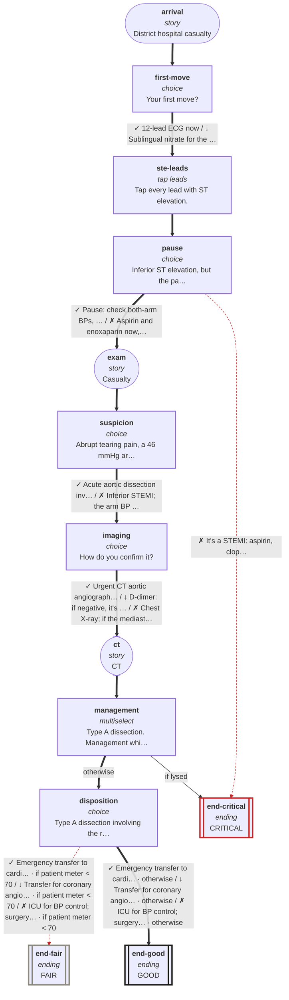

# cvs-cp-06: 59M, sudden chest pain, sweaty and pale

_Generated by `npm run graph`; do not edit by hand._

Shapes: rounded = story, box = decision, double box = ending (red border = critical).
Arrow marks: ✓ best · ~ acceptable · ↓ suboptimal · ✗ harmful (red dashed). **Bold arrows = ideal path.**

## Ideal path

- **all settings:** arrival → first-move → ste-leads → pause → exam → suspicion → imaging → ct → management → disposition → end-good
