# cvs-cp-07: 34F, sharp chest pain and short of breath

_Generated by `npm run graph`; do not edit by hand._

Shapes: rounded = story, box = decision, double box = ending (red border = critical).
Arrow marks: ✓ best · ~ acceptable · ↓ suboptimal · ✗ harmful (red dashed). **Bold arrows = ideal path.**

```mermaid
flowchart TD
  n_arrival(["<b>arrival</b><br/><i>story</i><br/>Triage"])
  n_first_move["<b>first-move</b><br/><i>choice</i><br/>Your first move?"]:::decision
  n_ecg_1["<b>ecg-1</b><br/><i>ecg</i><br/>What does the ECG show?"]:::decision
  n_history(["<b>history</b><br/><i>story</i><br/>Majors"])
  n_wells["<b>wells</b><br/><i>calculator</i><br/>Work out her Wells score for PE."]:::decision
  n_testing["<b>testing</b><br/><i>choice</i><br/>PE likely. What next?"]:::decision
  n_ctpa(["<b>ctpa</b><br/><i>story</i><br/>CT"])
  n_risk["<b>risk</b><br/><i>choice</i><br/>Normal BP, RV dilated on CT, trop…"]:::decision
  n_deteriorate(["<b>deteriorate</b><br/><i>story</i><br/>Monitored bed"])
  n_high_risk["<b>high-risk</b><br/><i>choice</i><br/>She is now hypotensive and confus…"]:::decision
  n_end_good[["<b>end-good</b><br/><i>ending</i><br/>GOOD"]]:::good
  n_end_fair[["<b>end-fair</b><br/><i>ending</i><br/>FAIR"]]:::fair
  n_arrival --> n_first_move
  n_first_move -->|"✓ 12-lead ECG and oxygen to k… / ✗ Young and well-looking: pro…"| n_ecg_1
  n_ecg_1 -->|"✓ Sinus tachycardia with a ri… / ↓ Anterior NSTE-ACS: T invers… / ↓ Normal apart from a fast ra…"| n_history
  n_history --> n_wells
  n_wells --> n_testing
  n_testing -->|"✓ CT pulmonary angiography; s… / ↓ D-dimer first; CT only if i… / ↓ Apply PERC: she's young"| n_ctpa
  n_ctpa --> n_risk
  n_risk -->|"✓ Intermediate-high risk: ant… / ↓ Systemic thrombolysis now / ✗ Low risk: start an oral ant…"| n_deteriorate
  n_deteriorate --> n_high_risk
  n_high_risk -->|"✓ High-risk PE: systemic thro… · if patient meter #lt; 70 / ✗ Two litres of fluid, fast · if patient meter #lt; 70 / ✗ Keep going with heparin; re… · if patient meter #lt; 70"| n_end_fair
  n_high_risk -->|"✓ High-risk PE: systemic thro… · otherwise / ✗ Two litres of fluid, fast · otherwise / ✗ Keep going with heparin; re… · otherwise"| n_end_good
  linkStyle 0 stroke-width:4px
  linkStyle 1 stroke-width:4px
  linkStyle 2 stroke-width:4px
  linkStyle 3 stroke-width:4px
  linkStyle 4 stroke-width:4px
  linkStyle 5 stroke-width:4px
  linkStyle 6 stroke-width:4px
  linkStyle 7 stroke-width:4px
  linkStyle 8 stroke-width:4px
  linkStyle 9 stroke:#c62828,stroke-dasharray:4 3
  linkStyle 10 stroke-width:4px
  classDef decision stroke-width:2px
  classDef good stroke:#1a1915,stroke-width:3px
  classDef fair stroke:#8a877d,stroke-width:3px
  classDef critical stroke:#c62828,stroke-width:3px
```

## Ideal path

- **all settings:** arrival → first-move → ecg-1 → history → wells → testing → ctpa → risk → deteriorate → high-risk → end-good
