# cvs-cp-08: 28M, sharp chest pain, worse lying flat

_Generated by `npm run graph`; do not edit by hand._

Shapes: rounded = story, box = decision, double box = ending (red border = critical).
Arrow marks: ✓ best · ~ acceptable · ↓ suboptimal · ✗ harmful (red dashed). **Bold arrows = ideal path.**

```mermaid
flowchart TD
  n_arrival(["<b>arrival</b><br/><i>story</i><br/>Triage"])
  n_first_move["<b>first-move</b><br/><i>choice</i><br/>Your first move?"]:::decision
  n_ecg_1["<b>ecg-1</b><br/><i>ecg</i><br/>Widespread ST elevation. What is …"]:::decision
  n_features(["<b>features</b><br/><i>story</i><br/>Majors"])
  n_treatment["<b>treatment</b><br/><i>multiselect</i><br/>Acute pericarditis. Treatment? Ch…"]:::decision
  n_echo_1(["<b>echo-1</b><br/><i>story</i><br/>Bedside echo"])
  n_disposition["<b>disposition</b><br/><i>choice</i><br/>Low-grade temperature, normal tro…"]:::decision
  n_return(["<b>return</b><br/><i>story</i><br/>Three days later · Triage"])
  n_ecg_2["<b>ecg-2</b><br/><i>ecg</i><br/>His new ECG. What does it suggest?"]:::decision
  n_pocus(["<b>pocus</b><br/><i>story</i><br/>Bedside echo"])
  n_tamponade["<b>tamponade</b><br/><i>choice</i><br/>Cardiac tamponade. What now?"]:::decision
  n_end_good[["<b>end-good</b><br/><i>ending</i><br/>GOOD"]]:::good
  n_end_fair[["<b>end-fair</b><br/><i>ending</i><br/>FAIR"]]:::fair
  n_end_critical[["<b>end-critical</b><br/><i>ending</i><br/>CRITICAL"]]:::critical
  n_arrival --> n_first_move
  n_first_move -->|"✓ 12-lead ECG now / ↓ Paracetamol and wait to see…"| n_ecg_1
  n_ecg_1 -->|"✓ Acute pericarditis: widespr… / ↓ Extensive STEMI: activate t… / ✗ Extensive STEMI: give a fib…"| n_features
  n_features -->|"if lysed"| n_end_critical
  n_features -->|"otherwise"| n_treatment
  n_treatment --> n_echo_1
  n_echo_1 --> n_disposition
  n_disposition -->|"✓ Home with treatment, review… / ↓ Admit for observation / ↓ Discharge; no follow-up nee…"| n_return
  n_return --> n_ecg_2
  n_ecg_2 -->|"✓ Low voltage with electrical… / ✗ Recurrent pericarditis: inc… / ↓ Normal apart from a fast ra…"| n_pocus
  n_pocus --> n_tamponade
  n_tamponade -->|"✓ Urgent echo-guided pericard… · if patient meter #lt; 70 / ✗ IV furosemide for heart fai… · if patient meter #lt; 70 / ✗ Intubate and ventilate firs… · if patient meter #lt; 70"| n_end_fair
  n_tamponade -->|"✓ Urgent echo-guided pericard… · otherwise / ✗ IV furosemide for heart fai… · otherwise / ✗ Intubate and ventilate firs… · otherwise"| n_end_good
  linkStyle 0 stroke-width:4px
  linkStyle 1 stroke-width:4px
  linkStyle 2 stroke-width:4px
  linkStyle 4 stroke-width:4px
  linkStyle 5 stroke-width:4px
  linkStyle 6 stroke-width:4px
  linkStyle 7 stroke-width:4px
  linkStyle 8 stroke-width:4px
  linkStyle 9 stroke-width:4px
  linkStyle 10 stroke-width:4px
  linkStyle 11 stroke:#c62828,stroke-dasharray:4 3
  linkStyle 12 stroke-width:4px
  classDef decision stroke-width:2px
  classDef good stroke:#1a1915,stroke-width:3px
  classDef fair stroke:#8a877d,stroke-width:3px
  classDef critical stroke:#c62828,stroke-width:3px
```

## Ideal path

- **all settings:** arrival → first-move → ecg-1 → features → treatment → echo-1 → disposition → return → ecg-2 → pocus → tamponade → end-good
