# cvs-cp-09: Night shift: three ECGs arrive at once

_Generated by `npm run graph`; do not edit by hand._

Shapes: rounded = story, box = decision, double box = ending (red border = critical).
Arrow marks: ✓ best · ~ acceptable · ↓ suboptimal · ✗ harmful (red dashed). **Bold arrows = ideal path.**

```mermaid
flowchart TD
  n_shift(["<b>shift</b><br/><i>story</i><br/>Night shift"])
  n_a_intro(["<b>a-intro</b><br/><i>story</i><br/>Patient A · {clock}"])
  n_a_ecg["<b>a-ecg</b><br/><i>ecg</i><br/>Patient A. What does the ECG show…"]:::decision
  n_a_posterior["<b>a-posterior</b><br/><i>tap leads</i><br/>Posterior leads (V7–V9 replace V4…"]:::decision
  n_a_plan["<b>a-plan</b><br/><i>choice</i><br/>Posterior STEMI confirmed. Plan?"]:::decision
  n_b_intro(["<b>b-intro</b><br/><i>story</i><br/>Patient B · {clock}"])
  n_b_ecg["<b>b-ecg</b><br/><i>ecg</i><br/>Patient B. What does the ECG show?"]:::decision
  n_c_intro(["<b>c-intro</b><br/><i>story</i><br/>Patient C · {clock}"])
  n_c_ecg["<b>c-ecg</b><br/><i>ecg</i><br/>Patient C, 55, pain-free now. Wha…"]:::decision
  n_c_plan["<b>c-plan</b><br/><i>choice</i><br/>Wellens pattern, pain-free, first…"]:::decision
  n_end_good[["<b>end-good</b><br/><i>ending</i><br/>GOOD"]]:::good
  n_end_fair[["<b>end-fair</b><br/><i>ending</i><br/>FAIR"]]:::fair
  n_shift --> n_a_intro
  n_a_intro --> n_a_ecg
  n_a_ecg -->|"✓ ST depression V1–V3 with ta… / ↓ Anterior ischaemia: treat a… / ✗ No ST elevation, so not a S…"| n_a_posterior
  n_a_posterior --> n_a_plan
  n_a_plan -->|"✓ STEMI pathway: primary PCI … / ✗ NSTE-ACS pathway: angiograp…"| n_b_intro
  n_b_intro --> n_b_ecg
  n_b_ecg -->|"✓ de Winter pattern: a STEMI … / ↓ Hyperacute T waves: repeat … / ✗ Up-sloping ST depression is…"| n_c_intro
  n_c_intro --> n_c_ecg
  n_c_ecg -->|"✓ Wellens pattern: likely a c… / ↓ Non-specific T wave changes"| n_c_plan
  n_c_plan -->|"✓ Admit, treat as NSTE-ACS, e… · if patient meter #lt; 70 / ✗ Exercise stress test in the… · if patient meter #lt; 70 / ✗ Troponin is normal: dischar… · if patient meter #lt; 70"| n_end_fair
  n_c_plan -->|"✓ Admit, treat as NSTE-ACS, e… · otherwise / ✗ Exercise stress test in the… · otherwise / ✗ Troponin is normal: dischar… · otherwise"| n_end_good
  linkStyle 0 stroke-width:4px
  linkStyle 1 stroke-width:4px
  linkStyle 2 stroke-width:4px
  linkStyle 3 stroke-width:4px
  linkStyle 4 stroke-width:4px
  linkStyle 5 stroke-width:4px
  linkStyle 6 stroke-width:4px
  linkStyle 7 stroke-width:4px
  linkStyle 8 stroke-width:4px
  linkStyle 9 stroke:#c62828,stroke-dasharray:4 3
  linkStyle 10 stroke-width:4px
  classDef decision stroke-width:2px
  classDef good stroke:#1a1915,stroke-width:3px
  classDef fair stroke:#8a877d,stroke-width:3px
  classDef critical stroke:#c62828,stroke-width:3px
```

## Ideal path

- **all settings:** shift → a-intro → a-ecg → a-posterior → a-plan → b-intro → b-ecg → c-intro → c-ecg → c-plan → end-good
