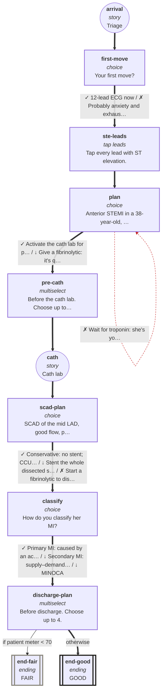

# cvs-cp-10: 38F, chest pain six weeks after her baby

_Generated by `npm run graph`; do not edit by hand._

Shapes: rounded = story, box = decision, double box = ending (red border = critical).
Arrow marks: ✓ best · ~ acceptable · ↓ suboptimal · ✗ harmful (red dashed). **Bold arrows = ideal path.**

## Ideal path

- **all settings:** arrival → first-move → ste-leads → plan → pre-cath → cath → scad-plan → classify → discharge-plan → end-good
